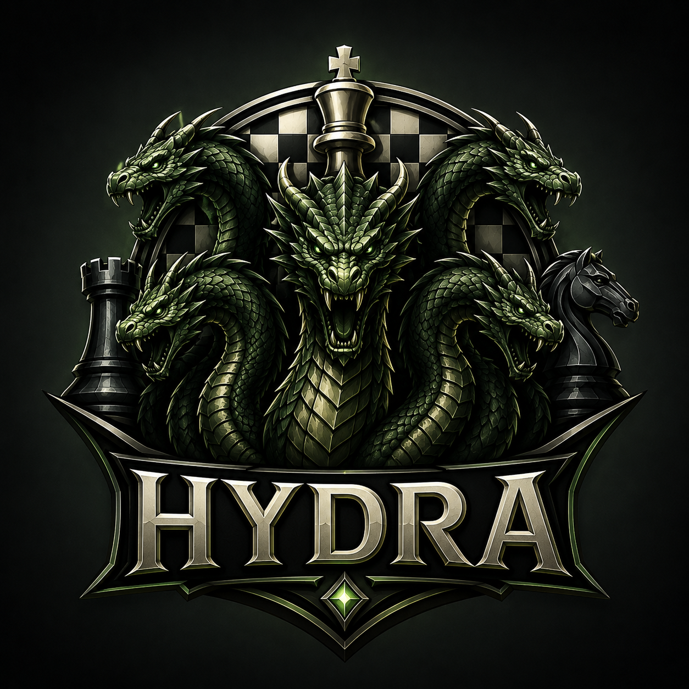

# Hydra

<p align="center">
  
</p>

UCI-compatible chess engine written in Python, with optional native Syzygy tablebase support through the bundled Fathom probe code.

---

## Features

### Search
- **Principal Variation Search** (PVS) with iterative deepening
- **Transposition table** with Zobrist hashing
- **Null Move Pruning** (NMP) with verification
- **Late Move Reductions** (LMR) tuned with continuation history
- **Futility Pruning** and **Reverse Futility Pruning**
- **Late Move Pruning** (LMP)
- **Singular Extensions** — double extension, multicut, negative extension
- **ProbCut** with quiescence pre-filter
- **SEE** (Static Exchange Evaluation) — capture ordering and pruning
- **Soft / hard time split** with best-move stability scaling

### Move Ordering
- TT move, MVV-LVA captures, killer moves, countermove heuristic
- Quiet history, capture history, continuation history (1-ply and 2-ply)
- Correction history (pawn and non-pawn)

### Evaluation (classical HCE)
- Material + piece-square tables, tapered middlegame / endgame interpolation
- Mobility for all piece types
- King safety with attack weighting
- Pawn structure — passed pawns, isolated, doubled, backward, phalanx
- Knight outposts
- Evaluation cache (65 536 entries) for repeated-position reuse
- Pawn cache (32 768 entries) for structure reuse

### Infrastructure
- **Bitboard representation** with magic bitboard sliding attacks
- **Full legal move generation** with check evasion and perft validation
- **Make / Unmake** with history stack — no board copying
- **Full UCI protocol** with threaded search (always-responsive input loop)
- **Correct ponder / infinite handling** — no early `bestmove` before `stop` or `ponderhit`
- **Pondering** support
- **Syzygy tablebase probing** through UCI-compatible options
- **Bench command** for node-count regression testing
- No runtime Python package dependencies

---

## Releases

- [Latest release](https://github.com/maelic13/hydra/releases/latest)
- [All releases](https://github.com/maelic13/hydra/releases)

Release assets include standalone executables for
Windows (x64, arm64), macOS (arm64), and Linux (x64, arm64).

### macOS permissions

To run on macOS, allow the executable with:

```bash
xattr -d com.apple.quarantine <path_to_executable>
chmod +x <path_to_executable>
```

---

## Requirements

- Python 3.11 or newer
- Use the same Python version when comparing release builds or strength-test results; Python runtime changes can affect nodes/second
- A C/C++ compiler when installing from source or building Syzygy support

### Source install toolchains

Installing from source builds the bundled Fathom tablebase extension. If you only want to run Hydra, download a standalone
executable from the [latest release](https://github.com/maelic13/hydra/releases/latest) instead.

| Platform | Required toolchain |
|----------|--------------------|
| Windows x64 | Visual Studio Build Tools or Visual Studio with **Desktop development with C++**, **MSVC Build Tools for x64/x86 (Latest)**, and a Windows 10/11 SDK |
| Windows ARM64 | Visual Studio Build Tools or Visual Studio with **Desktop development with C++**, **MSVC Build Tools for ARM64/ARM64EC (Latest)**, **MSVC Build Tools for x64/x86 (Latest)**, and a Windows 10/11 SDK. The x64/x86 tools are recommended because some Python packaging tools still use host utilities from that toolchain. |
| macOS ARM64 | Apple command line developer tools: `xcode-select --install` |
| Linux x64 | GCC or Clang plus Python development headers. On Debian/Ubuntu: `sudo apt install build-essential python3-dev`; Fedora: `sudo dnf install gcc gcc-c++ python3-devel`; Arch: `sudo pacman -S base-devel python` |
| Linux ARM64 | GCC or Clang plus Python development headers. On Debian/Ubuntu: `sudo apt install build-essential python3-dev`; Fedora: `sudo dnf install gcc gcc-c++ python3-devel`; Arch: `sudo pacman -S base-devel python` |

Windows users can install Build Tools from
[visualstudio.microsoft.com/visual-cpp-build-tools](https://visualstudio.microsoft.com/visual-cpp-build-tools/). Open a
new PowerShell window after installing the toolchain, then reactivate the virtual environment before rerunning `pip install`.

---

## Install and Run

After the required platform toolchain is installed, install Hydra from a virtual environment:

```bash
# Install (use a virtual environment)
pip install .

# Start the UCI engine
hydra
```

Or run directly without installing:

```bash
python -m hydra.uci
```

---

## UCI Options

| Option   | Type  | Default   | Min | Max      | Description                              |
|----------|-------|-----------|-----|----------|------------------------------------------|
| Hash     | spin  | 64        | 1   | 33554432 | Transposition table size in MB           |
| Threads  | spin  | 1         | 1   | 1        | Number of search threads (single-threaded search) |
| Ponder   | check | false     | —   | —        | Allow engine to think on opponent's time |
| Move Overhead | spin | 10 | 0 | 5000 | Time buffer in milliseconds kept for GUI/process overhead |
| SyzygyPath | string | `<empty>` | — | — | Syzygy tablebase directory |
| SyzygyProbeDepth | spin | 1 | 1 | 100 | Minimum search depth for in-search WDL probes |
| Syzygy50MoveRule | check | true | — | — | Respect the 50-move rule in tablebase root probes |
| SyzygyProbeLimit | spin | 7 | 0 | 7 | Maximum piece count for tablebase probing |

---

## Bench

The `bench` command searches 16 representative positions to a fixed depth and prints a node-count summary. The total node count acts as a fingerprint — any change to search, eval, or move generation produces a different value.

```
bench [depth]   (default: 9)
```

Example output:

```
bench 1/16  depth 9  score 22  nodes 13204  time 812ms  nps 16254
...
=========================
Total time (ms) : 29460
Nodes searched  : 559253
Nodes/second    : 18983
```

---

## Development

Development installs use the same compiler requirement as normal source installs. On Windows, if editable install fails
with `Microsoft Visual C++ 14.0 or greater is required`, install the C++ Build Tools listed in Requirements, open a new
shell, reactivate the virtual environment, and rerun the install command.

```bash
# Install with dev dependencies
pip install -e ".[build,dev]"

# Run tests
pytest

# Lint and format
ruff check .
ruff format .
```

Current regression coverage includes unit tests for move generation, search, UCI protocol behavior, ponder handling, Syzygy probing, malformed GUI input, FEN compatibility, release build configuration, version metadata consistency, and release baseline guardrails.

```bash
pytest -q
ruff check hydra tests
```

The current 1.4.1 release keeps the 1.1.2 search/evaluation baseline and completes UCI ponder support. Hydra now exposes only the classical evaluator through UCI. Treat 1.3.x as superseded for strength testing and release builds. Hydra 1.4.1 passes `106` tests, passes Ruff, and `bench 9` searches `559253` nodes, matching the Hydra 1.1.2 search/evaluation node tree. Before `Move Overhead` was reintroduced, a baseline-only 300-game Cutechess match at `3+0.2` against Hydra 1.1.2 scored `+129 =65 -106`; excluding time-forfeit games, the score was effectively even at `+76 =64 -75`.

---

## Build a Local Executable

The standalone executable must be built after compiling the native Fathom extension. If the extension is not present when PyInstaller runs, Hydra will still start, but Syzygy tablebase support will not be bundled.

Recommended Windows release build, using Python 3.12 because it produced the fastest local PyInstaller executable in fixed-depth bench testing:

```powershell
# Create and activate a clean Python 3.12 virtual environment
py -3.12 -m venv .venv
.\.venv\Scripts\Activate.ps1

# Install build dependencies
python -m pip install --upgrade pip
pip install -e ".[build]"

# Build the native tablebase extension
python setup.py build_ext --inplace

# Build with PyInstaller
pyinstaller --clean --onefile --optimize=2 --noupx --name hydra hydra/uci.py
```

The executable will be created in the `dist/` folder.

### Compiled build (mypyc) — recommended for release

The hot modules can be compiled to native extensions with
[mypyc](https://mypyc.readthedocs.io/) (bundled with `mypy`) for **~2× the
node rate** with **no change in playing behaviour** (identical `bench` node
count). This requires the same C compiler as a source install.

```powershell
# Build a compiled engine into tools\engines\compiled\ (leaves the source tree pure)
pip install mypy
.\tools\build_mypyc.ps1
```

Run it with `python -S -m hydra` from `tools\engines\compiled\`, or point the
launch shim at it: `.\tools\run_hydra.cmd tools\engines\compiled`. The mypyc
build only accelerates the interpreter — it keeps CPython semantics, so Syzygy
tablebase support (ctypes/Fathom) is unaffected. GitHub release executables are
built from these compiled modules.

Local Windows PyInstaller benchmark, `bench 8`, median NPS over five alternating runs:

| Python | Median NPS |
|--------|------------|
| 3.12   | 34 464     |
| 3.14   | 32 097     |
| 3.13   | 31 487     |
| 3.11   | 31 438     |

GitHub release builds use Python 3.12 and run the native Fathom extension build before PyInstaller.

Quick verification:

```powershell
.\dist\hydra.exe
uci
setoption name SyzygyPath value D:\chess\Syzygy345
isready
position fen 8/8/8/8/4k3/8/8/5QK1 w - - 0 1
go depth 1
quit
```

A working Syzygy-enabled build should advertise the `Syzygy*` UCI options and print an `info` line containing `tbhits` for the sample tablebase position.

---

## Project Structure

```
hydra/
├── __init__.py       # Package metadata and version
├── types.py          # Constants: squares, pieces, castling, directions
├── bitboard.py       # Bit manipulation utilities, file/rank masks
├── attacks.py        # Magic bitboard sliding attacks, leaper tables
├── zobrist.py        # Deterministic Zobrist hash keys
├── moves.py          # 16-bit integer move encoding
├── board.py          # Board state: bitboards + mailbox + Zobrist
├── movegen.py        # Legal move generation, check evasion, perft
├── transposition.py  # Transposition table
├── evaluation.py     # Classical hand-crafted evaluation (HCE)
├── engine.py         # Iterative-deepening PVS search with all heuristics
├── syzygy.py         # Syzygy/Fathom tablebase adapter
├── bench.py          # Benchmark: fixed-depth search over 16 positions
├── uci.py            # UCI protocol with threaded search
└── native/fathom/    # Vendored Fathom tablebase probe code
```

---

## Architecture

### Board Representation

- **LERF square mapping**: a1 = 0, b1 = 1, …, h8 = 63
- **12 bitboards** (one per piece type per colour) plus colour occupancy and total occupancy
- **Mailbox array** (64 entries) for O(1) piece-on-square lookup
- **Piece types**: Pawn = 0, Knight = 1, Bishop = 2, Rook = 3, Queen = 4, King = 5

### Move Encoding

16-bit integer: `from_sq:6 | to_sq:6 | promotion:2 | flag:2`

Flags: 0 = normal, 1 = promotion, 2 = en passant, 3 = castling

### Performance Optimizations

- Inlined make/unmake helpers (no function call overhead)
- Lightweight legality check without full make/unmake (occupancy simulation)
- Bulk counting at perft leaf nodes
- Check evasion generator (precomputed between-squares table)
- Inlined magic bitboard lookups with local aliases
- Dedicated capture-only generation for quiescence search
- Cached king squares updated incrementally

---

## Acknowledgements

Thank you to the Stockfish project and team for their long-standing work on chess engine design, UCI behavior, testing culture, and open-source engine development.

---

## License

GPL-3.0-or-later. See [LICENSE](LICENSE). The bundled Fathom probe code is MIT licensed; see [hydra/native/fathom/LICENSE](hydra/native/fathom/LICENSE).
